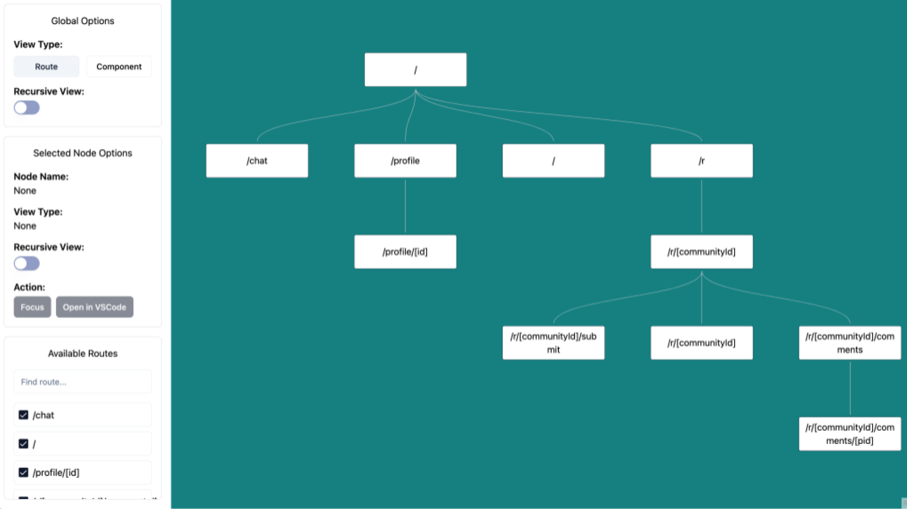
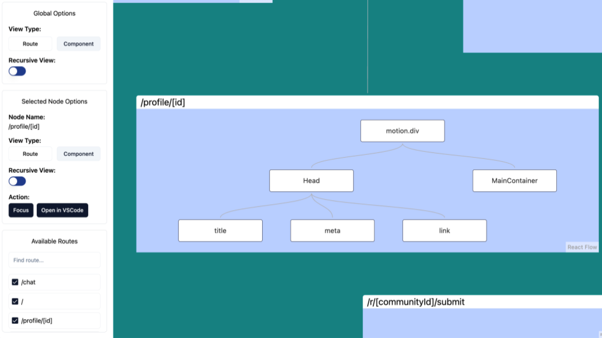

# Jabi Next Visualizer

Visualizer for Next.js page router showing routes and components in tree hierarchies.

<table>
  <thead>
    <tr>
      <th>Routes View</th>
      <th>Components View</th>
    </tr>
  </thead>
  <tbody>
    <tr>
      <td>
        <p align="center">
          
        </p>  
      </td>
      <td>
        <p align="center">
          
        </p>  
      </td>
    </tr>
  </tbody>
</table>

## How to Use:
1. Install package  
```
npm install jabi-next-visualizer
```
2. Run parse to parse project's source code  
```
npx jabi-next-visualizer extract
```
3. Run server for visualizer app preview  
```
npx jabi-next-visualizer visualize
```

## Deployment:
After developing package:  
1. Build the TypeScript file  
```
npm run tsc
```
It will create new folder named `cli-build`.  

2. Build visualizer app  
```
cd app && npm run build
```

## Development:
`app` folder contain visualizer app using Next.js page router. `cli` folder contain cli app, server app, and config constants.
